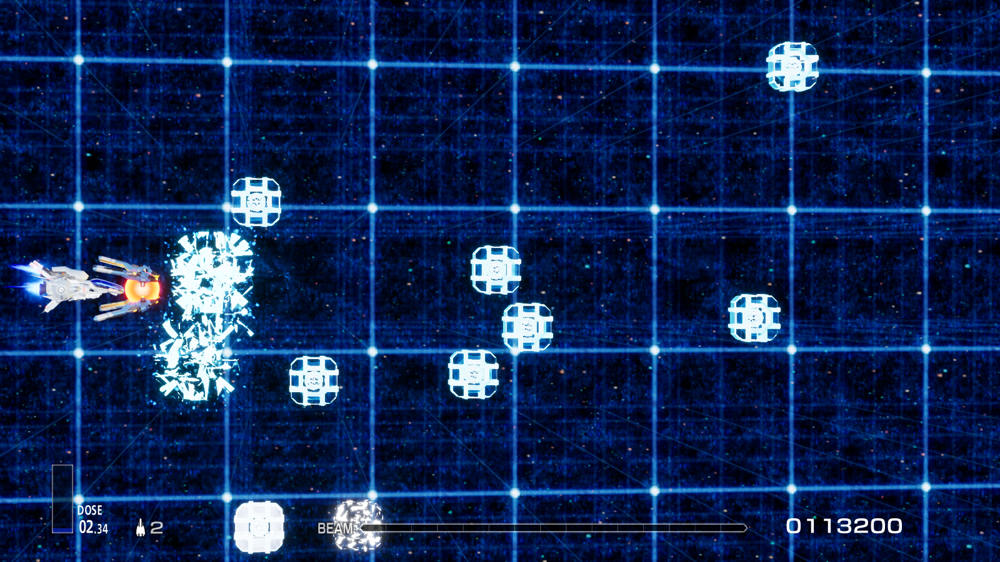
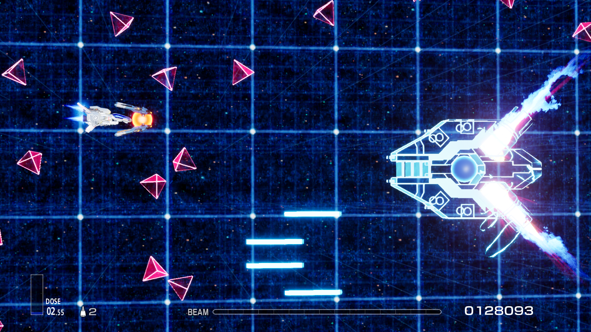
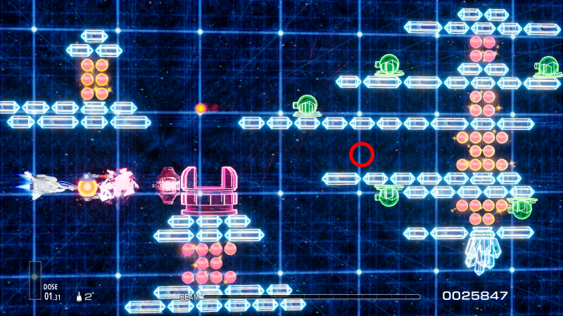

[简体中文](Readme/README.zhs.md) | [日本語](Readme/README.ja.md)

# Bringing MSX Gradius Stage 2 to R-Type Final 2

This mod features a new stage called *"Stage G2.0 Recreation: Stonehenge in Reverse Space."* It recreates the second stage from the original MSX *Gradius* and redesigns the visuals with a "Reverse Space" theme.

## Installation Guide
This stage mod consists of three components: a `LUA Mod`, a `PAK Mod`, and a `Blueprint Mod`. Please refer to the following table for separate installation instructions.

| File | Type | Installation Guide |
|-----|-----|-----|
| GradiusStage2.pak | Blueprint Mod | [Installing Blueprint Mod](https://github.com/BLACKujira/RTF2ModdingGuide/blob/master/Chapter1_TheBasics/en/InstallingBlueprintMods.md) |
| GradiusStage2_StageList_P.pak | PAK Mod | [Installing PAK Mod](https://github.com/BLACKujira/RTF2ModdingGuide/blob/master/Chapter1_TheBasics/en/InstallingPAKMods.md) |
| GradiusStage2_AddEnum.zip | LUA Mod | [Installing LUA Mod](https://github.com/BLACKujira/RTF2ModdingGuide/blob/master/Chapter1_TheBasics/en/InstallingLUAMods.md) |

After successful installation, launching the game should produce the following output, indicating the successful installation of each mod type. Ensure that all three logs are displayed.

```
[xx:xx:xx] [Lua] Add ST_2500 to Enum EStageId （LUA Mod Installed Successfully）
...
[xx:xx:xx] [Lua] [GradiusStage2] GradiusStage2 Loaded （Blueprint Mod Installed Successfully）
[xx:xx:xx] [Lua] [GradiusStage2] Definition of Stage G2.0 in StageList detected （PAK Mod Installed Successfully）
```


Then, refer to [Entering Mod Stage Guide](https://github.com/BLACKujira/RTF2ModdingGuide/blob/master/Chapter1_TheBasics/en/EnterModLevels.md) to play the modded stage. The stage ID is `100`, and the enum name is `ST_2500`.

## Known Issues
- The stage currently only has one difficulty setting; changing the difficulty will not affect the stage.
- The crystal glow dims when moving up or down. This is not an intentional design, and the cause is unknown.
- The randomness of the Zub Rush section can be high. Try obtaining the bit item in the middle of the stage to pass through this section smoothly.
- **Since the mod replaces the stage list, future game updates may prevent access to new official stages. Please remove the mod if this occurs.**

## Screenshots
  
  
  

## Postscript
This stage was created to test the feasibility of *stage mods*. Many features required unconventional solutions to function correctly. For example:

- Enemy lifecycle functions cannot listen to events or be hooked/overridden. Therefore, the project uses variable changes to detect whether these functions have been called. This may cause a one-frame delay in enemy state changes compared to the original game.
- Enemy bullets do not move after spawning. I created a subclass to update bullet positions, but this caused bullets not to stop upon hitting walls. A workaround was implemented by detecting wall-hit effects to stop bullet movement.
- Upon spawning, enemy bullets move to the world origin and have an instantaneous hitbox. I moved the initial damage detection off-screen and repositioned the bullet back on-screen in the first frame to resolve this issue.

These workarounds introduced many uncertainties, so the stage may still have undiscovered issues, especially near the world origin. If you encounter gameplay problems in the world origin area (marked by the red circle in the image below), please avoid this region for now and feel free to submit feedback.


