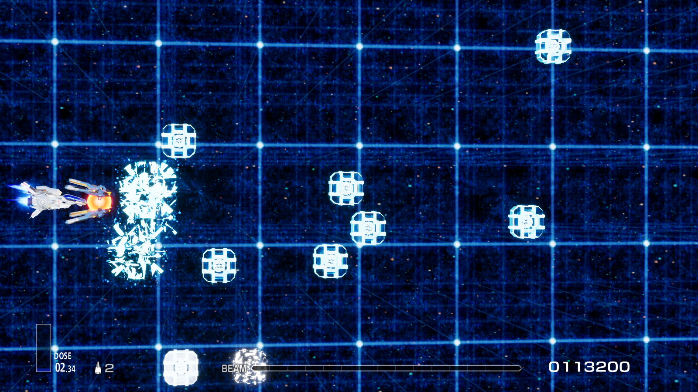
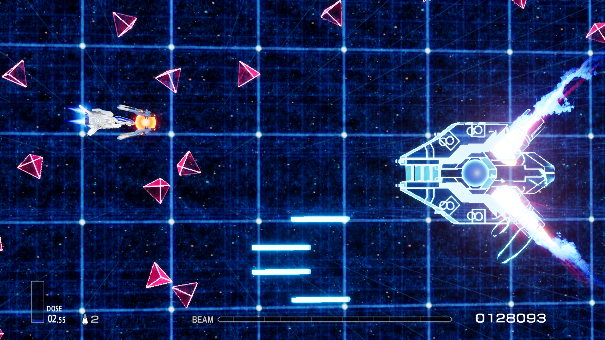
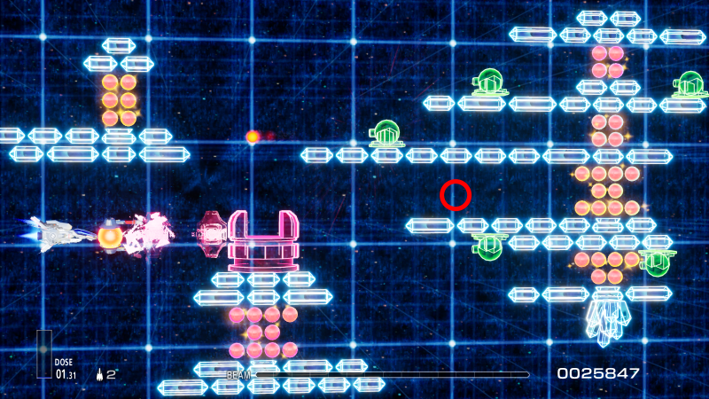

# MSX Gradius 第2ステージを R-Type Final 2 に移植

本Modには新ステージ「Stage G2.0 再現・逆流空間の巨石陣」が含まれています。このステージはMSX版初代『グラディウス』の第2ステージを再現し、"逆流空間"をテーマにグラフィックを再デザインしました。

## インストールガイド
本ステージModは、`LUA Mod`、`PAK Mod`、`ブループリント Mod`の3つで構成されています。以下の表を参照して、それぞれをインストールしてください。

| ファイル | タイプ | インストールチュートリアル |
|-----|-----|-----|
| GradiusStage2.pak | Blueprint Mod | [ブループリントのインストール](https://github.com/BLACKujira/RTF2ModdingGuide/blob/master/Chapter1_TheBasics/ja/ブループリントModのインストール.md) |
| GradiusStage2_StageList_P.pak | PAK Mod | [PAK Modのインストール](https://github.com/BLACKujira/RTF2ModdingGuide/blob/master/Chapter1_TheBasics/ja/PAKModのインストール.md) |
| GradiusStage2_AddEnum.zip | LUA Mod | [LUA Modのインストール](https://github.com/BLACKujira/RTF2ModdingGuide/blob/master/Chapter1_TheBasics/ja/LUAModのインストール.md) |

インストールが成功すると、ゲーム起動時に以下の出力が表示されます。三行それぞれが異なるModのインストール成功を示します。すべてのログが表示されていることを確認してください。

```
[xx:xx:xx] [Lua] Add ST_2500 to Enum EStageId （LUA Mod インストール成功）
...
[xx:xx:xx] [Lua] [GradiusStage2] GradiusStage2 Loaded （Blueprint Mod インストール成功）
[xx:xx:xx] [Lua] [GradiusStage2] Definition of Stage G2.0 in StageList detected （PAK Mod インストール成功）
```

その後、[Modステージへの進入ガイド](https://github.com/BLACKujira/RTF2ModdingGuide/blob/master/Chapter1_TheBasics/ja/Modステージに入る方法.md)に従ってゲームを進めてください。このステージのIDは `100` で、列挙名は `ST_2500` です。

## 既知の問題
- 現在このステージは1つの難易度のみ対応しており、難易度を変更してもステージ内容は変わりません。
- 上下移動時にクリスタルの輝きが暗くなる現象がありますが、これは意図した効果ではありません。原因は不明です。
- Zub Rushのランダム性が高いため、ステージ中間でbitアイテムを取得することで安定した攻略が可能です。
- **ステージリストを差し替えているため、ゲームアップデート後に新しい公式ステージに進入できなくなる可能性があります。その際はModを削除してください。**

## スクリーンショット
  
  
  

## 制作後記
このステージは*ステージMod*の実現性を検証するために制作しました。多くの機能は非常に特殊な方法でようやく動作しています。具体的には次のような問題がありました。

- 敵のライフサイクル関数がイベントをリスンできず、Hookやオーバーライドもできません。そのため、特定の変数の変化を監視することで敵の状態変化を判断しています。この方法では状態変化がオリジナル版より1フレーム遅れることがあります。
- 敵の弾が生成後に移動しないため、弾の位置を更新するサブクラスを作成しましたが、壁に当たった際に弾が停止しない問題が発生しました。そのため、壁に当たるエフェクトを検出して弾の移動を停止する方法を導入しました。
- 敵の弾が生成時に世界の原点に移動し、一瞬だけ当たり判定が発生します。これを回避するため、弾の生成時に当たり判定を画面外に移動させ、生成後の1フレーム目に戻すことでようやく問題を解決しました。

これらの対策により、多くの不確定要素が生まれたため、ステージ内にはまだ未発見の問題が多く残っている可能性があります。特に世界の原点（以下の図の赤い円で示した位置）で異常が発生する場合があります。このエリアでは一時的に回避するか、問題をフィードバックいただけると幸いです。


