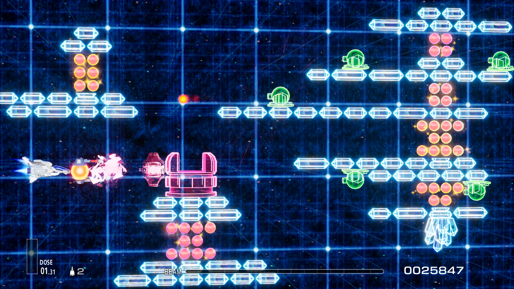

# 将 MSX Gradius 的第二关带到 R-Type Final 2

这个Mod包含一个新关卡 *「Stage G2.0 重现・逆流空间中的巨石阵」* 。关卡复刻了 MSX 初代《宇宙巡航机》的第二关，并以 "逆流空间" 为主题重新设计了画面。

## 安装指南
这个关卡Mod由一个`LUA Mod` 、一个 `PAK Mod` 和一个 `Blueprint Mod`组成。请参考下面的表格分别安装它们。

| 文件 | 类型 | 安装教程 |
|-----|-----|-----|
| GradiusStage2.pak | 蓝图Mod | [安装蓝图Mod](https://github.com/BLACKujira/RTF2ModdingGuide/blob/master/Chapter1_TheBasics/zhs/安装蓝图Mod.md) |
| GradiusStage2_StageList_P.pak | PAK Mod | [安装PAK Mod](https://github.com/BLACKujira/RTF2ModdingGuide/blob/master/Chapter1_TheBasics/zhs/安装PAKMod.md) |
| GradiusStage2_AddEnum.zip | LUA Mod | [安装LUA Mod](https://github.com/BLACKujira/RTF2ModdingGuide/blob/master/Chapter1_TheBasics/zhs/安装LUAMod.md) |

安装成功后启动游戏你会看到这样的输出，三行分别对应三种Mod已经安装成功，请确保三条日志均出现。

```
[xx:xx:xx] [Lua] Add ST_2500 to Enum EStageId （LUA Mod 安装成功）
...
[xx:xx:xx] [Lua] [GradiusStage2] GradiusStage2 Loaded （蓝图Mod 安装成功）
[xx:xx:xx] [Lua] [GradiusStage2] Definition of Stage G2.0 in StageList detected （PAK Mod 安装成功）
```

之后参考 [进入 Mod 关卡的教程](https://github.com/BLACKujira/RTF2ModdingGuide/blob/master/Chapter1_TheBasics/zhs/进入Mod关卡.md) 进行游戏。这个关卡的ID是 `100` 枚举名为 `ST_2500`.

## 已知问题
- 目前这个关卡只有一个难度，调整难度不会使关卡发生变化。
- 上下移动时水晶的光辉会变暗，这不是特意设计的效果。我也不知道这个问题是怎么产生的。
- Zub Rush的随机性有点大，可以争取一下关卡中间的bit道具，这样就能稳定通过这一段。
- **由于替换了关卡列表，游戏更新后很可能会导致无法进入新官方关卡，届时请移除 Mod**

## 图片



## 后记
这个关卡是为了验证 *关卡Mod* 的可行性而制作的。很多功能采用了非常奇怪的方式才正常工作。比如说

- 敌人的生命周期函数不能监听事件，也不能被Hook或重载。所以项目中通过监听一些变量的变化来判断其是否已经调用。这导致敌人状态的变化可能比原版的慢一帧。
- 敌人的子弹在生成后不会移动，所以我创建了一个子类来更新子弹的位置，但这带来了在击中墙壁后子弹不会停止的问题。于是又通过监听击中墙壁的特效来停止子弹的移动。
- 敌人的子弹在生成时会移动到世界原点，并且存在一个瞬时的判定。我将子弹生成时的伤害判定移动到屏幕之外，并在生成后第一帧移动回去，才勉强解决了这个问题。

这带来了非常多的不确定因素，所以关卡中可能还有很多没有被发现的问题。这些问题尤其容易出现在世界原点。如果你在关卡中的世界原点（见下图红圈位置）遇到无法正常游玩的情况，请暂时先尝试避开该区域，也欢迎提交反馈。

